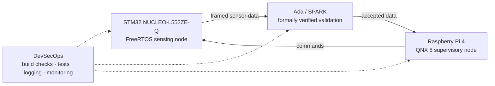

# DevSecOps-Oriented Real-Time Edge IoT Platform

CSI4900 honours project supervised by Prof. M. A. Ibrahim.

## Goal

Build and evaluate a two-node real-time IoT platform:

- an STM32/FreeRTOS sensing node collects sensor readings;
- an Ada/SPARK validation gate checks a critical safety or security rule;
- a Raspberry Pi/QNX supervisory node receives, validates, logs, and monitors data;
- DevSecOps practices provide automated checks, structured logs, runtime monitoring,
  and evidence for the final evaluation.

## Architecture



The minimum viable product is a reliable bidirectional link between the STM32 and
QNX nodes. Formal verification and monitoring are added only after that link is
stable.

## Planned repository layout

```text
firmware/stm32/       STM32CubeIDE and FreeRTOS sensing-node code
supervisor/qnx/       QNX C/C++ supervisory-node code
verification/spark/   Ada/SPARK validation component and proof configuration
shared/protocol/      Protocol specification and portable shared definitions
tests/                Host-side protocol and integration tests
docs/                 Setup, architecture, decisions, experiments, and report evidence
```

Directories will be introduced as their corresponding components are started,
keeping each change small and explainable.

## Development roadmap

1. Configure toolchains and source control.
2. Build the STM32/FreeRTOS sensing node.
3. Build the Raspberry Pi/QNX supervisory node.
4. Define and stabilize bidirectional communication.
5. Add structured logging, monitoring, validation, and CI.
6. Prove one critical validation rule with SPARK.
7. Measure latency, jitter, reliability, and abnormal-condition behavior.
8. Produce the report, presentation, and demonstration.

## Getting started

See [the Week 2 setup guide](docs/week-02-setup.md) for required software,
installation checks, and current setup status.

## Working principles

- Research current official guidance before choosing a solution.
- Compare alternatives and record important trade-offs.
- Protect the minimum viable system before adding stretch features.
- Understand, test, and document each increment before building on it.
- Keep commits small, descriptive, and reproducible.

