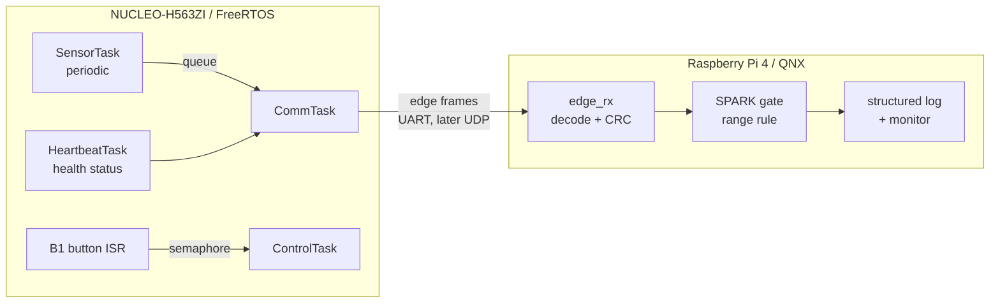

# Week 1: Requirements and Preliminary Architecture

Status: preliminary, to be reviewed with Prof. Ibrahim. Values marked *target*
are refined once Weeks 3-4 produce baseline measurements.

## 1. Scope

A two-node real-time edge IoT platform:

- **Sensing node:** STM32 NUCLEO-H563ZI running FreeRTOS. Samples sensor data
  at a fixed rate and sends framed messages to the supervisor.
- **Supervisory node:** Raspberry Pi 4 running QNX SDP 8.0. Receives,
  validates, logs, and monitors the data stream.
- **Validation gate:** an Ada/SPARK component that formally proves one
  critical acceptance rule before data is trusted.
- **DevSecOps layer:** structured logging, runtime monitoring, integrity and
  sequence checks, repeatable builds, and automated tests.

Out of scope unless the core is complete: TinyML anomaly detection,
TrustZone-backed secure communication, and a remote dashboard.

## 2. Preliminary architecture

The message format is defined once in `shared/protocol/edge_protocol.h` and
compiled into both nodes.

## 3. Hardware and interfaces

- **Sensing node:** NUCLEO-H563ZI (Cortex-M33, 250 MHz, 2 MB flash, 640 KB
  RAM, TrustZone, on-board ST-LINK, Ethernet). LEDs LD1-LD3 and button B1 are
  used for status and control.
- **Supervisory node:** Raspberry Pi 4 Model B, 32 GB microSD, official USB-C
  supply.
- **Sensor:** none purchased yet. Data is simulated by `sensor_sim`, which
  produces BME280-like temperature, humidity, and pressure values. A real I2C
  sensor can replace it behind the same interface.
- **Links available:** ST-LINK virtual COM port (USART3, PC debugging), a
  3.3 V UART between the boards, and Gigabit Ethernet through the 5-port
  switch. UART is the first transport; UDP over Ethernet is the Week 5
  candidate.

## 4. Functional requirements

- **FR1** The sensing node shall sample sensor data periodically at a
  configurable rate (10-200 ms).
- **FR2** The sensing node shall run at least four concurrent FreeRTOS tasks
  with distinct priorities.
- **FR3** The sensing node shall transmit each sample as a framed message
  containing a type, sequence number, timestamp, payload, and checksum.
- **FR4** The sensing node shall send a status message at least once per
  second containing health counters.
- **FR5** The supervisor shall receive frames, verify their integrity, and
  decode sensor and status messages.
- **FR6** The supervisor shall reject malformed, corrupted, or out-of-range
  data and record each rejection.
- **FR7** The supervisor shall detect lost, duplicated, and out-of-order
  messages using sequence numbers.
- **FR8** The supervisor shall detect when the sensing node goes silent.
- **FR9** The supervisor shall send commands to the sensing node, such as
  changing the sample rate (Week 5).
- **FR10** A SPARK-proven function shall decide whether a sensor reading is
  accepted.
- **FR11** Both nodes shall produce machine-parseable logs of messages,
  events, and errors.

## 5. Non-functional requirements

- **NFR1 Determinism:** time-critical work runs in fixed-priority tasks or
  threads; no unbounded blocking in the highest-priority sampling path.
- **NFR2 Integrity:** every frame is protected by CRC-16/CCITT, which detects
  all burst errors up to 16 bits.
- **NFR3 Robustness:** the receiver resynchronizes after corrupted, truncated,
  or garbage bytes without restarting.
- **NFR4 Portability:** protocol and timing code is plain C11 with no OS or
  HAL dependency, and is unit-tested on a PC.
- **NFR5 Observability:** each node exposes counters for sent, received,
  rejected, and dropped messages, timing jitter, and resource margins.
- **NFR6 Reproducibility:** all source is under Git; builds use documented
  toolchain versions and scripted commands.
- **NFR7 Resource safety:** stack overflow and heap exhaustion are detected
  and fail safe on the STM32.

## 6. Preliminary performance criteria

- **Sampling jitter:** at a 100 ms period, maximum jitter at most 1 ms, with
  zero overruns. *Target.*
- **End-to-end latency:** from sample to supervisor log, at most 20 ms over
  UART at 115200 baud. A 21-byte sensor frame takes about 1.8 ms on the wire.
  *Target.*
- **Reliability:** at least 99.9 % valid frames and zero sequence gaps during
  a one-hour soak test under normal conditions.
- **Fault detection:** 100 % of injected corrupted frames rejected, and none
  accepted as valid.
- **Silence detection:** a stopped sensing node reported within 3 heartbeat
  periods (3 s).
- **Recovery:** decoding resumes by the first intact frame after corruption.
- **QNX timing:** periodic-thread jitter at 2 ms and 10 ms periods, with and
  without CPU load, measured in Week 4 to set the supervisor's baseline.

## 7. Open questions for the supervisor

- Which QNX/Ada licence arrangement will be provided for running SPARK code on
  the Pi (GNAT Pro for QNX), or should the SPARK gate be proven on the PC and
  mirrored in C on QNX?
- Is a simulated sensor acceptable for the evaluation, or should an I2C sensor
  (for example, a BME280) be added?
- Is UDP over Ethernet acceptable as the final transport if UART is used for
  the first prototype?
