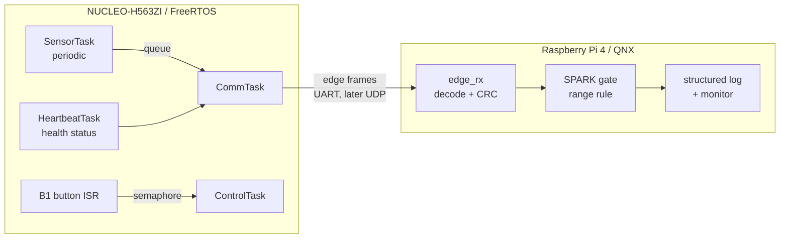

# Week 1 — Requirements and preliminary architecture

| | |
|---|---|
| **Focus** | What the platform must do, and how the two nodes divide the work |
| **Status** | Preliminary. Review with Prof. Ibrahim. Numbers marked *target* wait on Weeks 3–4 measurements |
| **Code this week** | None. This week is the specification the later code implements |

## What was done

The project was scoped as a two-node real-time edge IoT platform, and the first architecture, requirements, and performance targets were written down.

- The sensing node is the STM32 NUCLEO-H563ZI running FreeRTOS. It samples on a fixed period and sends framed messages.
- The supervisory node is a Raspberry Pi 4 running QNX SDP 8.0. It receives, checks, logs, and monitors the stream.
- One critical acceptance rule is reserved for an Ada/SPARK proof. DevSecOps work (structured logs, monitoring, integrity checks, repeatable builds, automated tests) sits around both nodes.
- Hardware, the first link (UART), and the message fields were chosen so Weeks 3 and 4 can share one protocol.
- TinyML, TrustZone-backed secure communication, and a remote dashboard stay out of scope until the core platform is complete.

## Theory

Week 1 is the requirements week. The ideas below are the ones the specification depends on.

### A requirement states an obligation, not a design

A **functional requirement** says what the system shall do (sample, frame, reject, detect silence). A **non-functional requirement** says how well, or under what constraints (jitter, integrity, portability, observability). Performance criteria then turn the non-functional requirements into numbers that a later experiment can pass or fail. Targets stay marked until a real measurement replaces the estimate.

### Fixed-priority real-time work

On both nodes, time-critical work is a thread or task with a fixed priority. The scheduler always runs the highest-priority ready job. A periodic job has a **period** (how often it is released), a **deadline** (when that job must finish), and **jitter** (how far the actual gap between releases wanders from the period). The sensing path is not allowed to block for an unbounded time, because a blocked sampler misses its next release.

### Integrity, sequence, and recovery

Every frame carries a CRC so a flipped bit is detected, and a sequence number so a lost, duplicated, or reordered frame is visible even when the CRC is fine. The receiver is a streaming decoder: after garbage or a truncated frame it must lock onto the next intact start marker without a restart. Silence is a separate fault. If heartbeats stop, the supervisor reports the node as gone, even though no bad frame arrived.

### One protocol, two transports

The application message (start marker, version, type, sequence, timestamp, length, payload, CRC) is independent of the wires underneath. UART is the first transport because it is point-to-point, 3.3 V on both boards, and easy to watch on a serial terminal. UDP over Ethernet is the later candidate. TCP is a poor fit for this stream: retransmissions make latency unbounded.

### Why one function is proved

Testing can show that many readings were accepted or rejected. A proof shows that the acceptance rule holds for every value the type allows. The project reserves that Gold-level argument for a single function, the sensor-reading gate, and leaves the rest of the system tested and measured.

## Architecture

The message format will live in one header, `shared/protocol/edge_protocol.h`, and be compiled into both nodes. Week 1 names that file. Week 3 writes it.

## Hardware and interfaces

| Piece | Choice |
|---|---|
| Sensing node | NUCLEO-H563ZI. Cortex-M33, 250 MHz, 2 MB flash, 640 KB RAM, TrustZone, on-board ST-LINK, Ethernet. LEDs LD1–LD3 and button B1 are the status and control I/O |
| Supervisory node | Raspberry Pi 4 Model B, 32 GB microSD, official USB-C supply |
| Sensor | None purchased. `sensor_sim` will emit BME280-like temperature, humidity, and pressure. A real I2C sensor can replace it behind the same payload type |
| Links | ST-LINK virtual COM port (USART3, for the PC), a 3.3 V UART between the boards, and Gigabit Ethernet through the 5-port switch |
| First transport | UART. UDP over Ethernet is the Week 5 candidate |

The MCU support package is STM32CubeH5. The original planning guide named an STM32L5 package; this board is an H5.

## Functional requirements

| ID | The system shall… |
|---|---|
| FR1 | Sample sensor data at a configurable period (10–200 ms) |
| FR2 | Run at least four concurrent FreeRTOS tasks, each at its own priority |
| FR3 | Transmit each sample as a framed message: type, sequence, timestamp, payload, checksum |
| FR4 | Send a status message at least once per second, carrying health counters |
| FR5 | On the supervisor, receive frames, check integrity, and decode sensor and status messages |
| FR6 | Reject malformed, corrupted, or out-of-range data, and record each rejection |
| FR7 | Detect lost, duplicated, and out-of-order messages from sequence numbers |
| FR8 | Detect when the sensing node goes silent |
| FR9 | Send commands to the sensing node, such as a sample-rate change (Week 5) |
| FR10 | Decide acceptance of a sensor reading with a SPARK-proved function |
| FR11 | Produce machine-parseable logs of messages, events, and errors on both nodes |

## Non-functional requirements

| ID | Obligation |
|---|---|
| NFR1 Determinism | Time-critical work runs in fixed-priority tasks or threads. The highest-priority sampling path does not block unboundedly |
| NFR2 Integrity | Every frame is protected by CRC-16/CCITT, which detects every burst error of up to 16 bits |
| NFR3 Robustness | The receiver resynchronizes after corrupted, truncated, or garbage bytes without a restart |
| NFR4 Portability | Protocol and timing code is plain C11, with no OS or HAL dependency, and is unit-tested on a PC |
| NFR5 Observability | Each node exposes counters for sent, received, rejected, and dropped messages, timing jitter, and resource margins |
| NFR6 Reproducibility | All source is under Git. Builds use documented toolchain versions and scripted commands |
| NFR7 Resource safety | Stack overflow and heap exhaustion are detected on the STM32 and fail safe |

## Performance criteria

These are targets. Weeks 3 and 4 replace the estimates with measured baselines.

| Criterion | Target |
|---|---|
| Sampling jitter | At a 100 ms period, maximum jitter at most 1 ms, and zero overruns |
| End-to-end latency | From sample to supervisor log, at most 20 ms over UART at 115200 baud. A 21-byte sensor frame is about 1.8 ms on the wire |
| Reliability | At least 99.9% valid frames, and zero sequence gaps, during a one-hour soak under normal conditions |
| Fault detection | 100% of injected corrupted frames rejected, and none accepted as valid |
| Silence detection | A stopped sensing node reported within 3 heartbeat periods (3 s) |
| Recovery | Decoding resumes on the first intact frame after corruption |
| QNX timing | Periodic-thread jitter at 2 ms and 10 ms, with and without CPU load, measured in Week 4 as the supervisor baseline |

## Open questions for the supervisor

1. Which QNX/Ada licence will be available for SPARK on the Pi (GNAT Pro for QNX)? If none, the gate is proved on the PC and mirrored in C on QNX.
2. Is a simulated sensor acceptable for the evaluation, or should an I2C sensor (for example a BME280) be added?
3. Is UDP over Ethernet acceptable as the final transport if UART is the first prototype?
